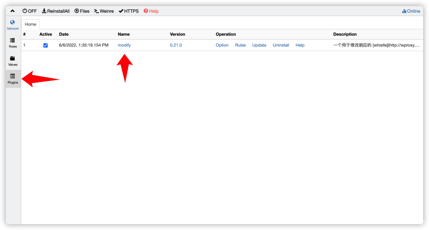
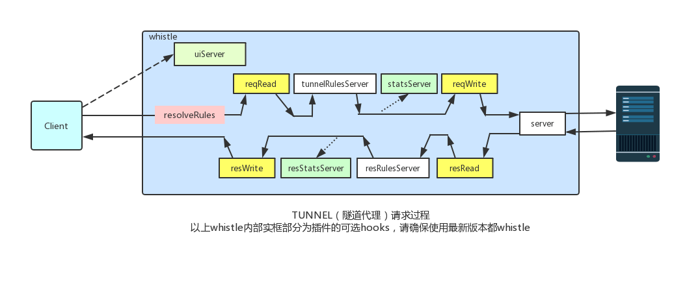
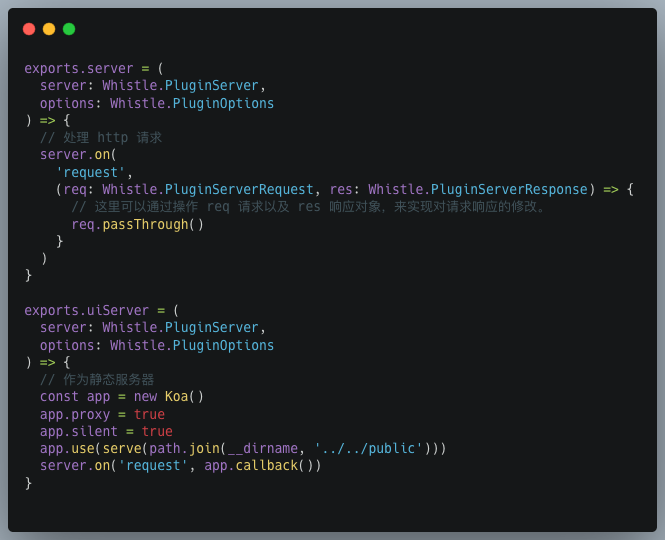
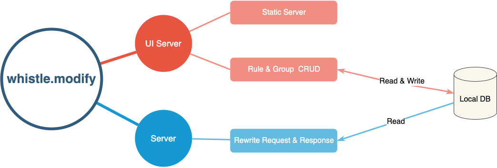

# whistle 插件开发入门 & 实践

## 什么是 whistle

[whistle](http://wproxy.org/whistle/) 是基于 Node.js 实现的跨平台 web 调试代理工具，类似 Charles、Fiddler 等。
常用的功能有查看、修改网络请求、响应。

在阅读下文之前最好对 [whistle](http://wproxy.org/whistle/) 有一个基础的使用经验。

## whistle 插件简介

### 什么是插件

whistle 提供了强大的插件扩展能力，一个插件就是一个 npm 包，也就是 Node.js 模块。
通过插件可以实现以下等功能。

1. 扩展 network 右键菜单。
2. 在 network / inspectors 自定义 tab。
3. 作为 web 服务。
4. 作为请求的中转 server（可对请求响应进行修改）。

关于插件的更多功能可查看 [whistle-plugins examples](https://github.com/whistle-plugins/examples)。

### 如何使用插件

比如现在有一个叫做 whistle.modify 的插件。

#### 安装插件

```sh
npm i -g whistle.modify
```

#### 查看 & 使用插件

安装成功之后，可以在 whistle 的插件管理页面中查看已经安装的插件。



## whistle 插件基本原理

whistle 是基于 Node.js 实现的，然而 whistle 插件是一个独立的进程，这样保证了插件不会影响到 whistle 主进程的稳定性。

whistle 插件会暴露一系列的 http server 来实现与 whistle 的交互。



从上面图可知，whistle 插件可以通过以上的一个个 server，来实现相关的功能。

这里介绍与下文即将实现的插件相关的 server。

- Server：whistle 会把指定请求转发到该 server。（通过实现该 server 可以对请求响应进行修改等。）
- UIServer：可作为静态服务为插件提供 UI 界面以及 API 等。

所以一个插件的基本代码框架可大致如下。



关于各个 server 的更多介绍可查看 [whistle 插件开发](http://wproxy.org/whistle/plugins.html)。

## whistle 插件开发

### 插件功能分析

下面将实现一个用于修改请求响应的 whistle 插件，详情可查看 [whistle.modify](https://www.npmjs.com/package/whistle.modify)。

1. 首先是 Rule 的增删改查，Rule 用于描述是如何匹配请求，匹配之后该如何修改这个请求的响应等。
2. 当 Rule 变多之后，会变得难以查找，为此增加了 Group 分组，用于分类管理 Rule。一个 Group 相当于一个文件夹，里面包含了多个 Rule。
   为此这里还有 Group 的增删改查。
3. 根据匹配的 Rule 来对请求响应进行修改。

### 技术任务拆解



#### UI Server

1. 首先要实现对 Rule 以及 Group 的增删改查，这里可以选择一些成熟的 Node.js Web 框架，比如 [Express](https://expressjs.com/)、[Koa](http://koajs.cn/)、[NestJS](https://nestjs.com/)。这里选用了 NestJS，因为它有以下优势。

   - TypeScript 友好。
   - 装饰器、AOP 等特性让代码更加清晰。
   - 拥有完整的开发范式。

2. 静态服务器，NestJS 官方的 [@nestjs/serve-static](https://www.npmjs.com/package/@nestjs/serve-static)。
3. 数据存储，在满足需求下选择了简单 [node-json-db](https://github.com/Belphemur/node-json-db)，直接存储一个 JSON 文件到使用者本地。

#### Server

1. 通过读取 whistle 传入的 request 对象判断该请求是否与本地存储的 Rule 匹配。
2. 如匹配，则修改 whistle 传入的 response 对象的响应为所匹配的 Rule 配置中的响应体。

### 项目创建

通过 whistle 官方提供的 [lack](https://github.com/avwo/lack) 可以快速生成一个 whistle 插件项目，然后我们可再按需进行修改。

[lack](https://github.com/avwo/lack) 也能监听本地插件的修改，让插件自动重启，便于本地调试。

因为此插件包含了 web 界面，所以对脚手架生成的项目结构进行调整，具体如下。

```txt
whistle.modify
├─ client // 前端
│    ├─ index.html
│    ├─ src
│    ├─ tsconfig.json
│    └─ tsconfig.node.json
├─ server // 服务端
│    ├─ src
│    │    ├─ server.ts
│    │    └─ ui-server.ts
│    ├─ test
│    ├─ tsconfig.build.json
│    ├─ tsconfig.json
│    └─ typings
├─ .eslintrc.js
├─ .gitignore
├─ .prettierrc
├─ README.md
├─ nest-cli.json
├─ package.json
├─ pnpm-lock.yaml
├─ rules.txt
└─ vite.config.ts
```

具体源码可查看 [https://github.com/xuwenchao66/whistle.modify](https://github.com/xuwenchao66/whistle.modify)

## whistle 插件还能做什么

1. 简化、统一开发团队的环境切换。
1. 请求数据解密。
1. 任何跟网络请求有关的，都可以发挥你的想象。

## 参考

1. [whistle](http://wproxy.org/whistle/)
1. [whistle 插件开发](http://wproxy.org/whistle/plugins.html)
1. [whistle-plugins examples](https://github.com/whistle-plugins/examples)
1. [lack - 生成 whistle 插件的脚手架](https://github.com/avwo/lack)
