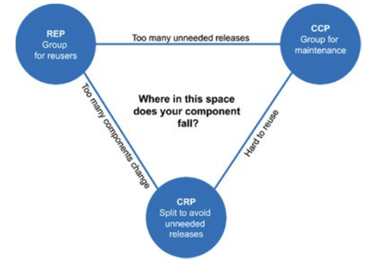
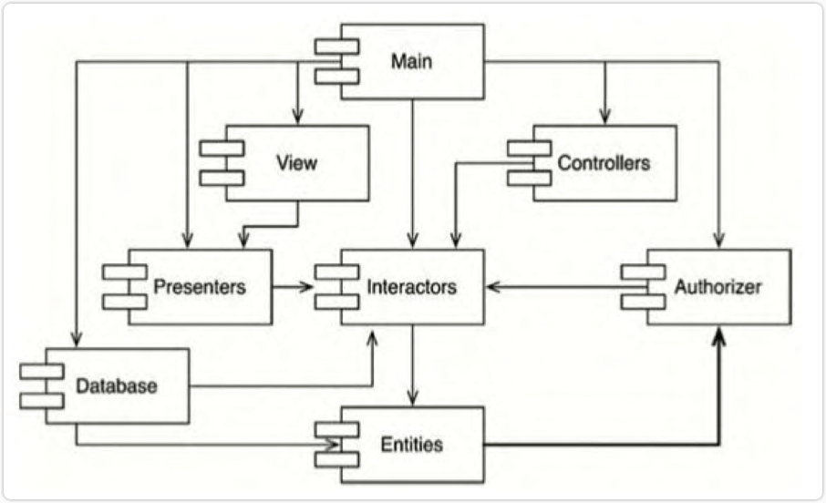
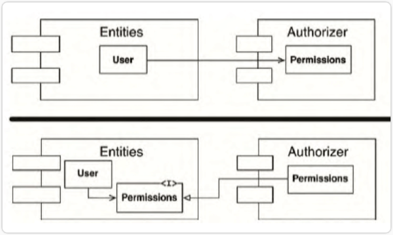
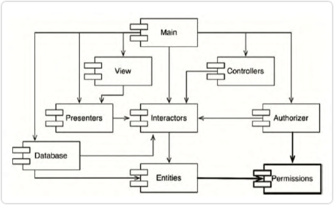
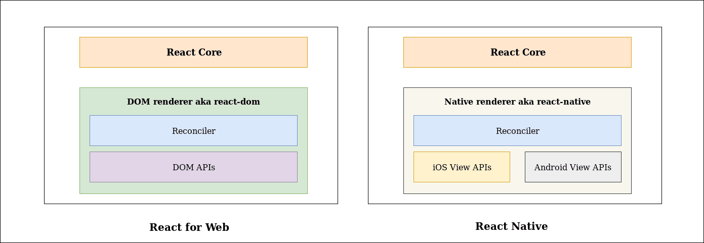
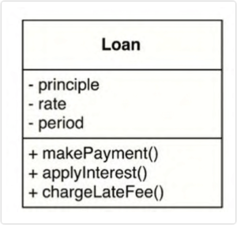
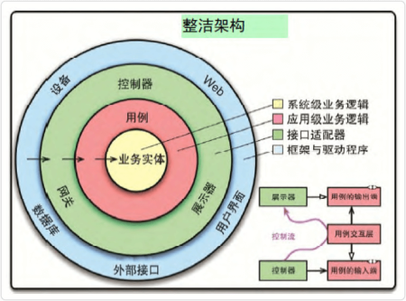

# 架构整洁之道

[https://book.douban.com/subject/30333919/](https://book.douban.com/subject/30333919/)

## 前言

- 所谓架构就是“用最小的人力成本来满足构建和维护系统需求”的设计行为。

- 大家对面向对象编程的一般理解是，由封装、继承、多态三种特性支持的，包含类、接口等若干概念的编程方式。但是从更深的层次上看，它也是一种设计范式。

- 多态大概算其中最神奇的特性了，程序员在确定接口时做好抽象，代码就可以很灵活，遇到新情况时，新写一个实现就可以无缝对接。

- 与语言无关，软件架构的规则是相同的。

## 第 1 部分 概述

### 第 1 章 设计与架构究竟是什么

- 软件架构的终极目标是，用最小的人力成本来满足构建和维护该系统的需求。

- 研发团队最好的选择是清晰地认识并避开工程师们过度自信的特点，开始认真地对待自己的代码架构，对其质量负责。

- 为了在系统构建过程中采用好的设计和架构以便减少构建成本，提高生产力，又需要先了解系统架构的各种属性与成本和生产力的关系。

### 第 2 章 两个价值维度

- 行为价值。软件系统的行为是其最直观的价值维度。程序员的工作就是让机器按照某种指定方式运转，给系统的使用者创造或者提高利润。

- 架构价值。软件系统的第二个价值维度，就体现在软件这个英文单词上：software。“ware”的意思是“产品”，而“soft”的意思，不言而喻，是指软件的灵活性。

- 研发团队必须从公司长远利益出发与其他部门抗争，这和管理团队的工作一样，甚至市场团队、销售团队、运营团队都是这样。

- 如果忽视软件架构的价值，系统将会变得越来越难以维护，终会有一天，系统将会变得再也无法修改。如果系统变成了这个样子，那么说明软件开发团队没有和需求方做足够的抗争，没有完成自己应尽的职责。

## 第 2 部分 从基础构件开始：编程范式

### 第 3 章 编程范式总览

- 三个编程范式。

  - 结构化编程（structured programming）

  - 面向对象编程（object-oriented programming）

  - 函数式编程（functional programming）

- 结构化编程。

  - 是第一个普遍被采用的编程范式。

  - Edsger Wybe Dijkstra 于 1968 年最先提出。 与此同时， Dijkstra 还论证了使用 goto 这样的无限制跳转语句将会损害程序的整体结构。接下来的章节我们还会说到，也是这位 Dijkstra 最先主张用我们现在熟知的 if/then/else 语句和 do/while/until 语句来代替跳转语句的。

  - 结构化编程对程序控制权的直接转移进行了限制和规范。

- 面向对象编程。

  - 在 ALGOL 语言中， 函数调用堆栈（call stack frame）可以被挪到堆内存区域里，这样函数定义的本地变量就可以在函数返回之后继续存在。这个函数就成为了一个类（class）的 构造函数，而它所定义的本地变量就是类的成员变量，构造函数定义的嵌套函数就成为了成员方法（method）。

  - 这样一来， 我们就可以利 用多态（polymorphism）来限制用户对函数指针的使用。

  - 面向对象编程对程序控制权的间接转移进行了限制和规范。

- 函数式编程。

  - 从理论上来说，函数式编程语言中应该是没有赋值语句的。大部分函数式编程语言只允许在非常严格的限制条件下，才可以更改某个变量的值。

  - 函数式编程对程序中的赋值进行了限制和规范。

- 上述的范式，和软件架构的三大关注重点不谋而合：功能性、组件独立性以及数据管理。

### 第 4 章 结构化编程

- 结构化编程范式可将模块递归降解拆分为可推导的单元，这就意味着模块也可以按功能进行降解拆分。

- 可以将一个大型问题拆分为一系列高级函数的组合，而这些高级函数各自又可以继续被拆分为一系列低级函数，如此无限递归。

- 结构化编程范式中最有价值的地方就是， 它赋予了我们创造可证伪程序单元的能力。

### 第 5 章 面向对象编程

- 封装

  - 面向对象编程语言为我们方便而有效地封装数据和函数提供了有力的支持，导致封装这个概念经常被引用为面向对象编程定义的一部分（内聚）。

  - 通过采用封装特性，我们可以把一组相关联的数据和函数圈起来，使圈外面的代码只能看见部分函数，数据则完全不可见（隔离）。

- 继承

  - 继承的主要作用是让我们可以在某个作用域内对外部定义的某一组变量与函数进行覆盖。

  - 虽然面向对象编程在继承性方面并没有开创出新，但是的确在数据结构的伪装性上提供了相当程度的便利性。

- 多态

  - 采用面向对象编程语言让多态实现变得 非常简单。

  - 面向对象编程其实是对程序间接控制权的转移进行了约束。

  - 软件架构师可以完全控制采用了面向对象这种编程方式的系统中所有的源代码依赖关系，而不再受到系统控制流的限制。不管哪个模块调用或者被调用，软件架构师都可以随意更改源代码依赖关系。

  - 当某个组件的源代码需要修改时，仅仅需要重新部署该组件，不需要更改其他组件，这就是独立部署能力。

  - 如果系统中的所有组件都可以独立部署，那它们就可以由不同的团队并行开发，这就是所谓的独立开发能力。

- 面向对象编程就是以多态为手段来对源代码中的依赖关系进行控制的能力，这种能力让软件架构师可以构建出某种插件式架构，让高层策略性组件与底层实现性组件相分离，底层组件可以被编译成插件，实现独立于高层组件的开发和部署。

### 第 6 章 函数式编程

- 一切并发应用遇到的问题， 一切由于使用多线程、多处理器而引起的问题，如果没有可变变量的话都不可能发生。

- 一个架构设计良好的应用程序应该将状态修改的部分和不需要修改状态的部分隔离成单独的组件，然后用合适的机制来保护可变量。

- 软件架构师应该着力于将大部分处理逻辑都归于不可变组件中，可变状态组件的逻辑应该越少越好。

- 函数式编程是对程序中赋值操作的限制。

## 第 3 部分 设计原则

- SOLID 原则的主要作用就是告诉我们如何将数据和函数组织成为类，以及如何将这些类链接起来成为程序。

- 一般情况下，我们为软件构建中层结构的主要目标如下：

  - 使软件可容忍被改动。

  - 使软件更容易被理解。

  - 构建可在多个软件系统中复用的组件。

### 第 7 章 SRP：单一职责原则

- 以面向底层实现细节的设计原则来说，可以理解为每个模块都应该只做一件事。

- 更广义的理解，任何一个软件模块都应该只对某一类行为者负责，有且只有一个（类）被修改的原则。

### 第 8 章 OCP：开闭原则

- 如果软件系统想要更容易被改变，那么其设计就必须允许新增代码来修改系统行为，而非只能靠修改原来的代码。

- 一个设计良好的计算机系统应该在不需要修改的前提下就可以轻易被扩展。

- OCP 是我们进行系统架构设计的主导原则，其主要目标是让系统易于扩展，同时限制其每次被修改所影响的范围。

- 实现方式是通过将系统划分为一系列组件，并且将这些组件间的依赖关系按层次结构进行组织，使得高阶组件不会因低阶组件被修改而受到影响。

### 第 9 章 LSP：里氏替换原则

- 强调了可替换性，如果想用可替换的组件来构建软件系统，那么这些组件就必须遵守同一个约定，以便让这些组件可以相互替换。

- LSP 可以且应该被应用于软件架构层面， 因为一旦违背了可替换性，该系统架构就不得不为此增添大量复杂的应对机制。

### 第 10 章 ISP：接口隔离原则

- 应该在设计中避免不必要的依赖。

- 在一般情况下，任何层次的软件设计如果依赖于不需要的东西，都会是有害的。

### 第 11 章 DIP：依赖反转原则

- 关于控制反转和依赖注入，可以看这里[浅谈控制反转与依赖注入](https://zhuanlan.zhihu.com/p/33492169)，通俗易懂、有实例。

- 高层策略性的代码不应该依赖实现底层细节的代码，恰恰相反，那些实现底层细节的代码应该依赖高层策略性的代码。

- 如果想要设计一个灵活的系统，在源代码层次的依赖关系中就应该多引用抽象类型，而非具体实现。

- 在应用 DIP 时，我们也不必考虑稳定的操作系统或者平台设施，因为这些系统接口很少会有变动，我们主要应该关注的是软件系统内部那些会经常变动的具体实现模块。

- 每次修改抽象接口的时候，一定也会去修改对应的具体实现。但反过来，当我们修改具体实现时，却很少需要去修改相应的抽象接口。所以我们可以认为接口比实现更稳定。

- 如果想要在软件架构设计上追求稳定，就必须多使用稳定的抽象接口，少依赖多变的具体实现。

- 应在代码中多使用抽象接口，尽量避免使用那些多变的具体实现类。

- 不要在具体实现类上创建衍生类，继承关系是所有一切源代码依赖关系中最强的、最难被修改的，所以我们对继承的使用应该格外小心。

- 不要覆盖（override）包含具体实现的函数。调用包含具体实现的函数通常就意味着引入了源代码级别的依赖。在这里，控制依赖关系的唯一办法，就是创建一个抽象函数，然后再为该函数提供多种具体实现。

- 应避免在代码中写入与任何具体实现相关的名字，或者是其他容易变动的事物的名字。

## 第 4 部分 组件构建原则

### 第 12 章 组件

- 组件是软件的部署单元，是整个软件系统在部署过程中可以独立完成部署的最小实体。

### 第 13 章 组件聚合

- 复用/发布等同原则（REP）。软件复用的最小粒度应等同于其发布的最小粒度。

- 共同闭包原则（CCP）。我们应该将那些会同时修改，并且为相同目的而修改的类放到同一个组件中，而将不会同时修改，并且不会为了相同目的而修改的那些类放到不同的组件中。

- 共同复用原则（CRP）。要强迫一个组件的用户依赖他们不需要的东西，该原则建议我们将经常共同复用的类和模块放在同一个组件中。

- 下图为组件聚合张力图，架构就是在追寻其中的平衡，优秀的软件架构师应该能在上述三角张力区域中定位一个最适合目前研发团队状态的位置，同时也会根据时间不停调整。

### 第 14 章 组件耦合

- 无依赖环原则。组件依赖关系图中不应该出现环。循环依赖增加了组件耦合，使得组件难以维护、测试、发布。

- 每周构建。要求所有人定期将自己所做的变更提交，进行统一构建。（定期集成构建，可提前发现问题，将集成时可能遇到的问题化大为小。）

- 消除循环依赖。将研发项目划分为一些可单独发布的组件，这些组件可以交由单人或者某一组程序员来独立完成。

- 打破循环依赖。

  如下图，Entities 组件中的 User 类使用了 Authorizer 组件中的 Permissions 类。 这就形成了一个 循环依赖关系。

  

  - 解决方式 1：可应用依赖反转原则（DIP）。

    创建一个 User 类需要使用的接口， 然后将这个接口放入 Entities 组件， 并在 Authorizer 组件中继承它。这样就将 Entities 与 Authorizer 之间的依赖关系反转了，自然也就打破了循环依赖关系。

    

  - 解决方式 2：创建一个新的公共组件。

    让 Entities 与 Authorize 这两个组件都依赖于它。将现有的这两个组件中互相依赖的类全部放入新组件。

    

- 自上而下的设计。

  - 组件结构图是不可能自上而下被设计出来的。它必须随着软件系统的变化而变化和扩张，而不可能在系统构建的最初就被完美设计出来。

  - 事实上，组件依赖结构图并不是用来描述应用程序功能的， 它 像是应用程序在**构建性**与**维护性**方面的一张地图。

  - 组件结构图中的一个重要目标是指导如何隔离频繁的变更（如何更好地支持后续多变的需求）。

- 稳定依赖原则，依赖关系必须要指向更**稳定**的方向。

- 稳定抽象原则，一个组件的抽象化程度应该与其稳定性保持一致。

  - 稳定抽象原则（SAP）为组件的稳定性与它的抽象化程度建立了一种关联。一方面，该原则要求稳定的组件同时应该是抽象的，这样它的稳定性就不会影响到扩展性。另一方面，该原则也要求一个不稳定的组件应该包含具体的实现代码，这样它的不稳定性就可以通过具体的代码被轻易修改。

  - 如果一个组件想要成为稳定组件，那么它就应该由接口和抽象类组成，以便将来做扩展。如此，这些既稳定又便于扩展的组件可以被组合成既灵活又不会受到过度限制的架构。

### 第 15 章 什么是软件架构

- 设计软件架构的目的，就是为了在工作中更好地对这些组件进行研发、部署、运行以及维护。

- 如果想设计一个便于推进各项工作的系统，其策略就是要在设计中尽可能长时间地保留尽可能多的**可选项**。

- 软件架构的终极目标就是最大化程序员的生产力，同时最小化系统的总运营成本。

- 部署。在通常情况下，一个系统的部署成本越高，可用性就越低。因此，实现一键式的轻松部署应该是我们设计软件架构的一个目标。

- 运行。

  - 一个设计良好的软件架构应该能明确地反映该系统在**运行时的需求**。

  - 设计良好的系统架构应该可以使开发人员对系统的**运行过程**一目了然。

  - 具体来说，就是该架构应该将系统中的**用例**、**功能**以及该系统的必备**行为**设置为对开发者**可见**的一级实体，**简化**它们对于**系统**的理解，这将为整个系统的开发与维护提供很大的帮助。

- 维护。

  - 在软件系统的所有方面中，维护所需的成本是最高的。满足永不停歇的新功能需求，以及修改层出不穷的系统缺陷这些工作将会占去绝大部分的人力资源。

  - 通过将系统切分为组件，并使用稳定的接口将组件隔离，我们可以将未来新功能的添加方式明确出来，并大幅度地降低在修改过程中对系统其他部分造成伤害的可能性。（前期定义开发接口，规范，这样能减少后续开发维护的成本。）

- 保持可选项。

  - 软件被发明出来就是因为我们需要一种灵活和便捷的方式来改变机器的行为。而软件的灵活性则取决于系统的整体状况、组件的布置以及组件之间的连接方式。

  - 让软件维持“软”性的方法就是尽可能长时间地保留尽可能多的可选项。

  - 软件架构师的目标是创建一种系统形态，该形态会以策略为最基本的元素，并让细节与策略脱离关系，以允许在具体决策过程中推迟或延迟与细节相关的内容。（高层尽可能抽象，脱离具体实现，后期能更灵活，有更多空间做决策。）

- 设备无关性。（可参考的 react 架构中 Renderer 是与平台无关的，而是由 React Dom、React Native 等来提供具体实现。）

  

### 第 16 章 独立性

- 一个设计良好的软件架构必须支持以下几点。

  - 系统的用例与正常运行，该系统的主要用例会在其系统结构上明确可见。

  - 系统的维护，如果该系统的架构能够在其组件之间做一些适当的隔离，同时不强制规定组件之间的交互方式，该系统就可以随时根据不断变化的运行需求来转换成各种运行时的线程、进程或服务模型。

  - 系统的开发，需要恰当地将系统切分为一系列隔离良好、可独立开发的组件。然后才能将这些组件分配给不同的团队，各自独立开发。

  - 系统的部署，一个设计良好的架构通常不会依赖于成堆的脚本与配置文件，也不需要用户手动创建一堆“有严格要求”的目录与文件。总而言之，一个设计良好的软件架构可以让系统在构建完成之后立刻就能部署。

- 保留可选项。一个设计良好的架构应该充分地权衡以上所述的所有关注点，然后尽可能地形成一个可以同时满足所有需求的组件结构。

- 开发的独立性。

  - 当系统组件之间被高度解耦之后，开发团队之间的干扰就大大减少了。

  - 只要系统按照其水平分层和用例进行了恰当的解耦， 整个系统的架构就可以支持多团队开发，不管团队组织形式是分功能开发、分组件开发、分层开发，还是按照别的什么变量分工都可以。

- 部署的独立性。如果解耦工作做得好，我们甚至可以在系统运行过程中热切换（hot-swap）其各个分层实现和具体用例。 在这种情况下， 我们增加新用例就只需要在系统中添加一些新的 jar 文件，或启动一些服务即可，其他部分将完全不受影响。

- 重复。

  - 重复的情况中也有一些是假的，或者说这种重复只是表面性的。如果有两段看起来重复的代码，它们走的是不同的演进路径，也就是说它们有着不同的**变更速率**和**变更缘由**，那么这两段代码就不是真正的重复。

  - 我们一定要小心避免陷入对任何重复都要立即消除的应激反应模式中。一定要确保这些消除动作只针对那些真正意义上的重复。

### 第 17 章 划分边界

- 软件架构设计本身就是一门划分边界的艺术。边界的作用是将软件分割成各种元素，以便约束边界两侧之间的依赖关系。

- 在项目初期划分这些边界的目的是方便 我们尽量将一些决策延后进行，并且确保未来这些决策不会对系统的 核心业务逻辑产生干扰。

- 一个系统最消耗人力资源的是什么？答案是系统中存在的耦合——尤其是那些过早做出的、不成熟的决策所导致的耦合。

- 通过划清边界，我们可以推迟和延后一些细节性的决策，这最终会为我们节省大量的时间、避免大量的问题。这就是一个设计良好的架构所应该带来的助益。

- 插件式架构。软件开发技术发展的历史就是一个如何想方设法方便地增加插件，从而构建一个可扩展、可维护的系统架构的故事。系统的核心业务逻辑必须和其他组件隔离，保持独立，而这些其他组件要么是可以去掉的，要么是有多种实现的。

- 为了在软件架构中画边界线，我们需要先将系统分割成组件，其中一部分是系统的核心业务逻辑组件，而另一部分则是与核心业务逻辑无关但负责提供必要功能的插件。然后通过对源代码的修改，让这些非核心组件依赖于系统的核心业务逻辑组件。

### 第 18 章 边界剖析

- 一个系统的架构是由一系列软件组件以及它们之间的边界共同定义的。

- 跨边界调用。在运行时，跨边界调用指的是边界线一侧的函数调用另一侧的函数，并同时传递数据的行为。所谓划分边界，就是指在这些模块之间建立这种针对变更的防火墙。

### 第 19 章 策略与层次

- 所有的软件系统都是一组策略语句的集合。可以说计算机程序不过就是一组仔细描述如何将输入转化为输出的策略语句的集合。

- 软件架构设计的工作重点之一就是，将这些策略彼此分离，然后将它们按照变更的方式进行重新分组。

- 在一个设计良好的架构中，依赖关系的方向通常取决于它们所关联的组件层次。一般来说，低层组件被设计为依赖于高层组件。

- 层次（Level）。一条策略距离系统的输入/输出越远，它所属的层次就越高。而直接管理输入/输出的策略在系统中的层次是最低的。

- 低层组件应该成为高层组件的插件。

### 第 20 章 业务逻辑

- 关键业务逻辑和关键业务数据是紧密相关的，所以它们很适合被放在同一个对象中处理。我们将这种对象称为“业务实体（Entity）”。

- 业务实体。实体对象要么直接包含关键业务数据，要么可以很容易地访问这些数据。业务实体的接口层则是由那些实现关键业务逻辑、操作关键业务数据的函数组成的。如下，一个借贷业务的 Loan 实体 UML 图。

  

- 业务实体类，独自代表了整个业务逻辑，它与数据库、用户界面、第三方框架等内容无关。该类可以在任何一个系统中提供与其业务逻辑相关的服务，它不会去管这个系统是如何呈现给用户的，数据是如何存储的，或者是以何种方式运行的。总而言之，业务实体这个概念中应该只有业务逻辑。

- 用例。用例所描述的是某种特定应用情景下的业务逻辑，它并非业务实体中所包含的关键业务逻辑。

- 业务实体并不会知道是哪个业务用例在控制它们， 这也是依赖反转原则（DIP）的另一个应用情景。也就是像业务实体这样的高层概念是无须了解像用例这样的低层概念的。反之，低层的业务用例却需要了解高层的业务实体。

### 第 21 章 尖叫的软件架构

- 架构设计的主题。

  - 软件的系统架构应该为该系统的用例提供支持。

  - 软件系统的架构设计图也应该非常明确地凸显该应用程序会有哪些用例。

- 架构设计的核心目标。

  - 一个良好的架构设计应该围绕着用例来展开，这样的架构设计可以在脱离框架、工具以及使用环境的情况下完整地描述用例。

- 一个系统的架构应该着重于展示系统本身的设计， 而并非该系统所使用的框架。

### 第 22 章 整洁架构

- 优秀架构设计出来的系统，通常都具有以下特点。

  - 独立于框架：这些系统的架构并不依赖某个功能丰富的框架之中的某个函数。框架可以被当成工具来使用，但不需要让系统来适应框架。

  - 可被测试：这些系统的业务逻辑可以脱离 UI、数据库、Web 服务以及其他的外部元素来进行测试。

  - 独立于 UI：这些系统的 UI 变更起来很容易，不需要修改其他的系统部分。例如，我们可以在不修改业务逻辑的前提下将一个系统的 UI 由 Web 界面替换成命令行界面。

  - 独立于数据库：我们可以轻易将这些系统使用的 Oracle、SQL Server 替换成 Mongo、BigTable、CouchDB 之类的数据库。因为业务逻辑与数据库之间已经完成了解耦。

  - 独立于任何外部机构：这些系统的业务逻辑并不需要知道任何其他外部接口的存在。

- 整洁架构。

  - 

  - 同心圆分别代表了软件系统中的不同层次， 通常越靠近中心，其所在的软件层次就越高。基本上，外层圆代表的是机制，内层圆代表的是策略。

  - 源码中的依赖关系必须只指向同心圆的内层，即由低层机制指向高层策略。就是任何属于内层圆中的代码都不应该牵涉外层圆中的代码，尤其是内层圆中的代码不应该引用外层圆中代码所声明的名字，包括函数、类、变量以及一切其他有命名的软件实体。

- 业务实体。业务实体这一层中封装的是整个系统的关键业务逻辑，一个业务实体既可以是一个带有方法的对象，也可以是一组数据结构和函数的集合。无论如何，只要它能被系统中的其他不同应用复用就可以。

- 用例。软件的用例层中通常包含的是特定应用场景下的业务逻辑，这里面封装并实现了整个系统的所有用例。

- 接口适配器。接口适配器层中通常是一组数据转换器，它们负责将数据从对用例和业务实体而言最方便操作的格式。

- 层次越往内，其抽象和策略的层次越高，同时软件的抽象程度就越高，其包含的高层策略就越多。最内层的圆中包含的是最通用、最高层的策略，最外层的圆包含的是最具体的实现细节。
