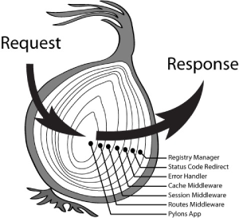

# koa-compose

koa是一个基于node.js的web开发框架，其最大特点就是它的中间件执行控制，洋葱模型。

现在来解读洋葱模型的实现核心[koa-compose](https://github.com/koajs/compose)。



在下面的解析中我们可以看到，compose过后的中间件函数调用栈跟这洋葱模型非常相似。

## 实现一个简版koa app

<<< @/docs/sourceCode/js/koaCompose/app.ts

## 实现compose函数

<<< @/docs/sourceCode/js/koaCompose/compose.ts

- 通过compose函数的调用方式`compose(this.middleware)(this.ctx)`，可知compose函数是一个高阶函数，返回一个函数。

  ```ts
  const compose = (middleware: Array<Function>, next?: Function) => {
    return (ctx: Object) => {}
  }
  ```

- 递归调用，`fn(ctx, () => dispatch(i + 1))`，为了方便异步编程，这里用`Promise.resolve`对函数返回值进行包装。

  ```ts
  Promise.resolve(fn(ctx, () => dispatch(i + 1)))
  ```

  这里的`() => dispatch(i + 1)`，就是我们中间件函数的第二个参数`next`。
  
  接受到请求的时候`dispatch(0)`入栈，当我们在第一个中间件中执行`next`的时候`dispatch(1)`入栈，在第二个中间件执行`next`的时候`dispatch(2)`入栈，

  以此类推，函数的调用栈大致如下：

  ```ts
  dispatch(0) {
    dispatch(1) {
      dispatch(2) {
        ...()
        }
      }
    }
  }
  ```

  这个调用栈就跟文章开头的洋葱模型的图一对比，就能明白这个模型是怎么产生的了。

- 源码中声明了一个变量`index`，来辅助实现当在一个中间件中多次调用`next`函数时，抛出错误。

  `index`从-1开始，`i`从0开始，执行`dispatch`后有一个`index = i`的赋值操作。
  
  通过分析调用栈可得，如果在一个中间件函数调用`next`的次数不超过一次，在经过`index = i`之前，`i > index`是恒成立的。

  反之假如我们在第一个中间件调用两次`next`，调用栈变成如下：

  ```ts
  dispatch(0) {
    dispatch(1) {
    }
    dispatch(1) {
    }
  }
  ```

  当执行第二个`dispatch(1)`时，因为在第一个`dispatch(1)`的时候，经过`index = i`，index已经等于1了，所以在第二个`dispatch(1)`中，index等于1，i也是等于1，有`index === i`

  所以当出现`i <= index`，那就说明在同一个中间件中调用了大于一次的next函数，此时抛出错误。

  ```ts
  if (i <= index) return Promise.reject(new Error('你在中间件中多次调用了next()'))
  ```

## 测试代码

<<< @/docs/sourceCode/js/koaCompose/test.ts

<sourceCode-koaCompose />

上面只对部分的核心代码进行解析，完整的实现请前往[https://github.com/koajs/compose/blob/master/index.js](https://github.com/koajs/compose/blob/master/index.js)

## 参考

1. [https://github.com/koajs/koa/blob/master/lib/application.js](https://github.com/koajs/koa/blob/master/lib/application.js)

2. [https://github.com/koajs/compose](https://github.com/koajs/compose)

3. [可能是目前市面上比较有诚意的Koa2源码解读](https://zhuanlan.zhihu.com/p/34797505)